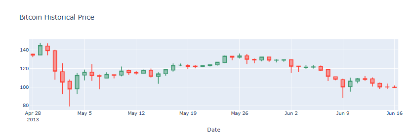

# ₿ Bitcoin Price Analysis

## 📌 Project Overview
This project analyzes Bitcoin price movements over time using Python and Jupyter Notebook.  
The analysis focuses on identifying patterns in price changes, candlestick trends, and time-based variations to better understand Bitcoin’s volatility and trading behavior.

---

## 🗂 Dataset
- Source: Bitcoin Historical Price Data  
- Data includes **date, opening price, high, low, close, and volume**.

---

## 🎯 Analysis Questions
The notebook addresses the following key questions:
1. **How has the Bitcoin price changed over time?**  
2. **What trends can we observe using candlestick charts?**  
3. **What insights can we draw from an in-depth look at the closing price?**  
4. **How do Bitcoin prices vary on a quarterly and monthly basis?**  
5. **What is the daily change in closing price, and how volatile is it?**  

---

## 🛠 Tools & Libraries
- Python  
- Jupyter Notebook  
- pandas, numpy  
- matplotlib, seaborn, cufflinks/plotly (for candlestick visualization)  

---

## 📊 Results & Insights
Some highlights from the analysis (see `images/` folder for charts):  

- **Overall Trend:** Bitcoin shows long-term growth but with extreme volatility.  
- **Candlestick Analysis:** Frequent sharp fluctuations suggest strong speculative trading.  
- **Closing Price (In-Depth):** Significant peaks observed in late 2017 and 2021.  
- **Quarterly & Monthly Analysis:** Seasonal patterns emerge, with Q4 often showing upward momentum.  
- **Daily Changes:** High daily volatility confirms Bitcoin’s risky trading profile.  

---

## 📸 Visualizations
Some sample outputs from the analysis:

| Price Over Time | Candlestick Chart |
|-----------------|-------------------|
|  |  |


|closing Price on Quarterly Basis | closing Price on Monthly Basis|
|-----------------|-------------------|
|  |  |


---

## ▶️ How to Run
1. Clone this repository:
   ```bash
   git clone https://github.com/MohammadAbdelqader/Bitcoin_Analysis_Practice.git
   cd Bitcoin_Analysis_Practice
